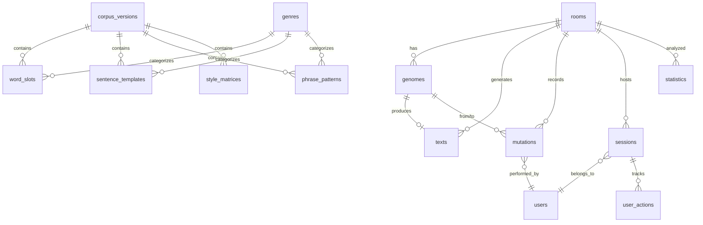
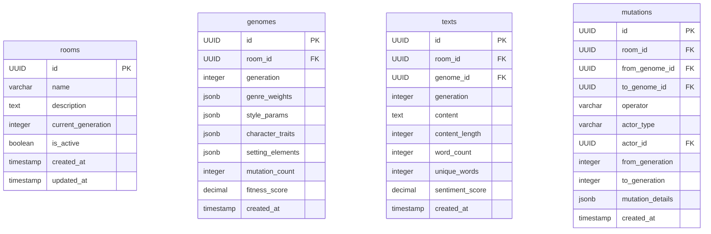
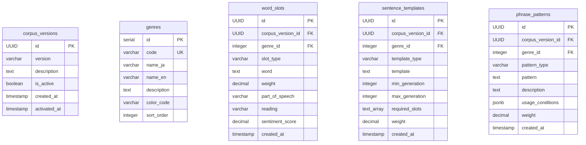
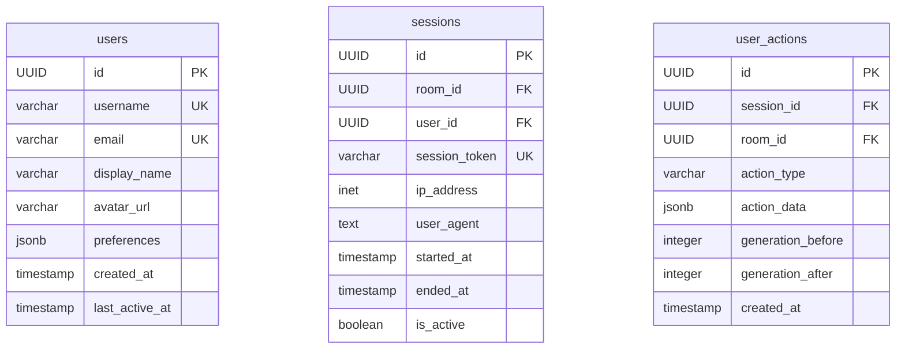
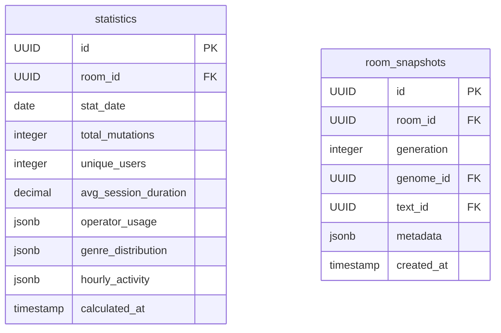

# GA Novelist データベース ER図

## 全体構成

## 主要テーブル構造

## コーパステーブル構造

## ユーザー管理テーブル

## 統計テーブル

## 特徴

1. **完全な履歴管理**: 全ての変更が記録される
2. **コーパスのバージョン管理**: 語彙データの世代管理
3. **JSONB活用**: 柔軟なデータ構造
4. **インデックス最適化**: 高速検索
5. **外部キー制約**: データ整合性保証

## 必要な要件

- PostgreSQL 15.x以上
- 拡張機能:
  - `uuid-ossp` (UUID生成)
  - `pg_trgm` (日本語全文検索)